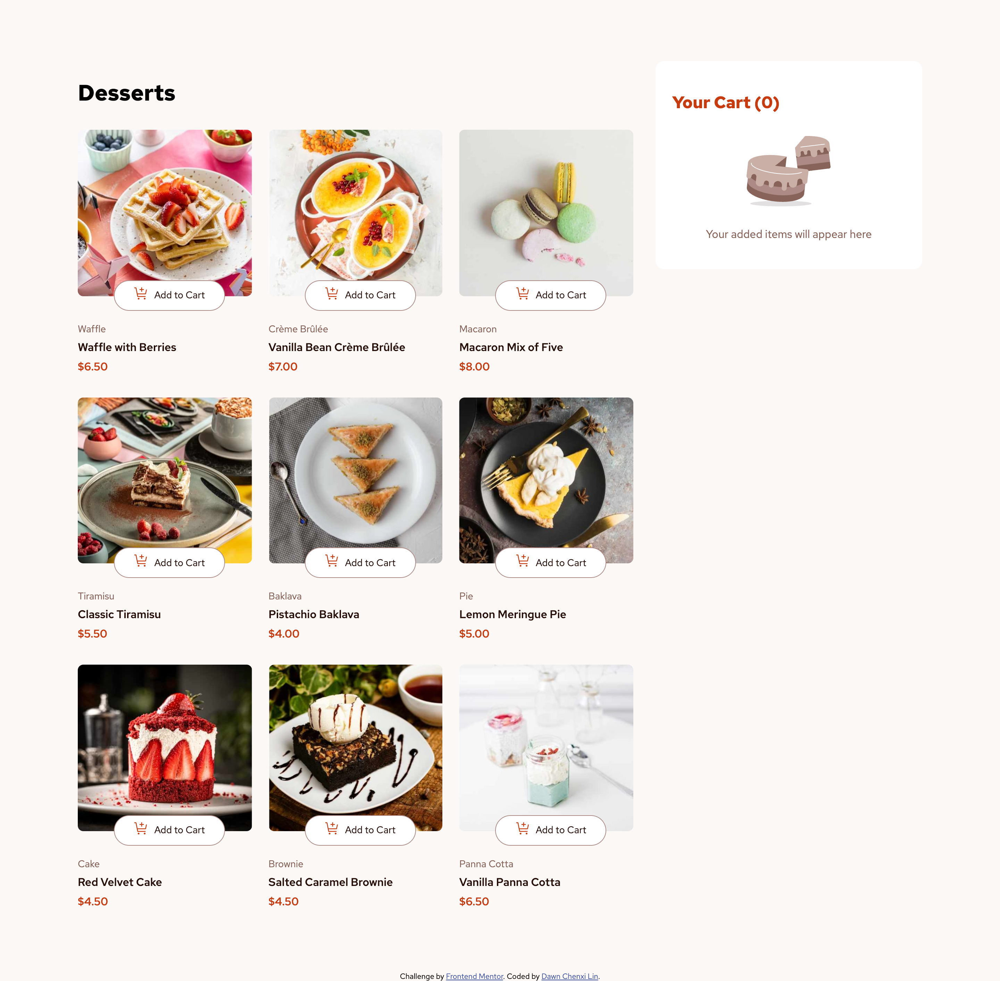

# Frontend Mentor - Product list with cart solution

This is a solution to the [Product list with cart challenge on Frontend Mentor](https://www.frontendmentor.io/challenges/product-list-with-cart-5MmqLVAp_d). Frontend Mentor challenges help you improve your coding skills by building realistic projects. 

## Table of contents

- [Overview](#overview)
  - [The challenge](#the-challenge)
  - [Screenshot](#screenshot)
  - [Links](#links)
- [My process](#my-process)
  - [Built with](#built-with)
  - [What I learned](#what-i-learned)
  - [Continued development](#continued-development)
  - [Useful resources](#useful-resources)
- [Author](#author)


## Overview

### The challenge

Users should be able to:

- Add items to the cart and remove them
- Increase/decrease the number of items in the cart
- See an order confirmation modal when they click "Confirm Order"
- Reset their selections when they click "Start New Order"
- View the optimal layout for the interface depending on their device's screen size
- See hover and focus states for all interactive elements on the page

### Screenshot



### Links

- Solution URL: [Add solution URL here](https://your-solution-url.com)
- Live Site URL: [Product list with cart](https://chenxi96.github.io/Product-List-With-Cart/)

## My process

### Built with

- Semantic HTML5 markup
- Flexbox
- Jquery
- Mobile-first workflow


### What I learned

I learned that if you have an async function it will run parallel. Basically it will run separately. Since Javascript executes code from top to bottom and when async function runs, the browser will not wait for the async function to finish to execute the other codes but it will have the async function running in the background while executing other codes.

To see how you can add code snippets, see below:

```js
async function submitOrder(cart) {
  const data = await fetchData();
}

console.log("Run first")
```

If you want more help with writing markdown, we'd recommend checking out [The Markdown Guide](https://www.markdownguide.org/) to learn more.

**Note: Delete this note and the content within this section and replace with your own learnings.**

### Continued development

I want to implement the DRY (Don't Repeat Yourself) principle to prevent the amount of ambiguous code and redundancy. I would like to be able to organize the logic so that each function does one thing.


### Useful resources

- [W3Schools](https://www.w3schools.com/jsref/api_fetch.asp) - This helps with me understanding how to fetch data from an api route or even just from another directory inside a folder.
- [Jquery Documentation](https://api.jquery.com/) - The documentation for Jquery helped me understand how to set up elements to be used in my project.


## Author

- Website - [Chenxi Dawn Lin](https://chenxi96.github.io/Portfolio/)
- Frontend Mentor - [@Chenxi96](https://www.frontendmentor.io/profile/Chenxi96)
- Twitter - [@Chenxi_Lin_](https://x.com/Chenxi_Lin_)


